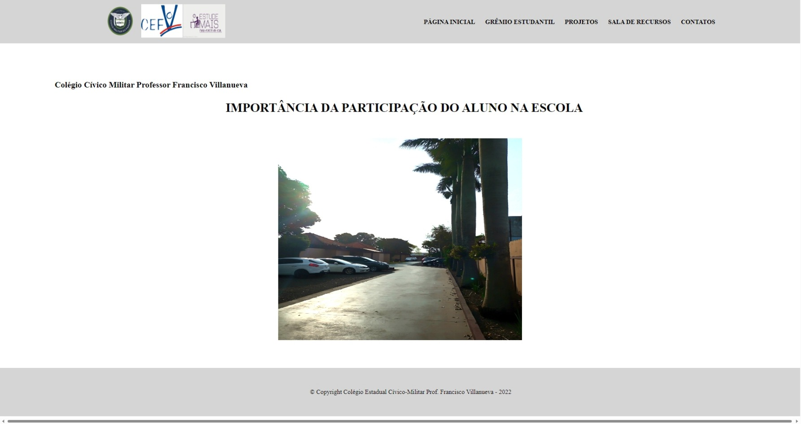

# Villanueva - importância do aluno na escola
> - Projeto desenvolvido para o concurso, feito por Thainá Ribeiro & Caio Landgraf

 

  <a href="https://caiolandgraf.github.io/villanueva">Acessar Projeto</a>

  

 

> -   Devs No Projeto

> [@caiolandgraf](https://github.com/caiolandgraf/) - [@thayyyyyy](https://github.com/thayyyyyy/)

---

> @Copyright [Caio Landgraf](https://github.com/caiolandgraf), [Thainá Ribeiro](https://github.com/thayyyyyy) - Todos Os Direitos Reservados!
